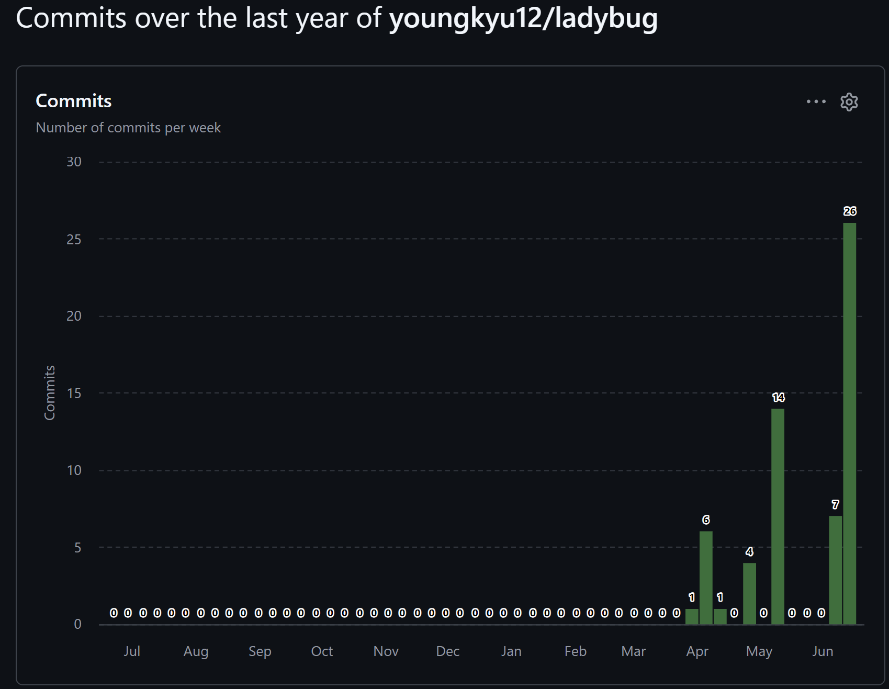

# 🐞 Ladybug - 텀 프로젝트 2차 발표

## 📌 제출 정보

| 항목                    | 링크                                                                                                               |
|-----------------------|------------------------------------------------------------------------------------------------------------------|
| 프로젝트 제목               | **Ladybug**                                                                                                      |
| Git Repository        | [youngkyu12/ladybug](https://github.com/youngkyu12/ladybug)                                                      |
| 3차 발표 영상              | [3차 발표 영상]()                                                                                                     |
| 2차 발표 영상              | [2차 발표 영상](https://youtu.be/c4JgwTX42bQ)                                                                         |
| 1차 발표 영상              | [1차 발표 영상](https://youtu.be/jJiFIIa5MSA)                                                                         |
| 1차 발표 때 버전의 README.md | [1차 발표 README.md](https://github.com/youngkyu12/ladybug/blob/d4902d7634d96e7a3af38170f36b83d7a12ad3c0/README.md) |
| 2차 발표 때 버전의 README.md | [2차 발표 README.md](https://github.com/youngkyu12/ladybug/blob/92d02a080c0995b7c281f61397aa2bb031cf9eed/README.md) |
| 개발 계획 체크 리스트          | [개발 계획 체크리스트](https://github.com/youngkyu12/ladybug/blob/main/andprj/README.md)                                  |

---

## 🎮 1. 게임 소개

**Ladybug**는 스마트폰을 기울여 무당벌레를 조작하고, 화면 위쪽에서 내려오는 적을 피하거나 제거하면서 오래 생존하는 캐주얼 생존 액션 게임이다. 

플레이어는 기기의 기울기 입력을 이용해 무당벌레를 움직인다. 
적은 일정 시간마다 화면 위쪽에서 생성되어 플레이어 방향으로 이동하며, 플레이어와 충돌하면 게임이 종료된다. 현재 구현된 버전에서는 플레이어가 화면을 터치하면 총알을 발사할 수 있고, 총알이 적과 충돌하면 적이 제거되며 점수가 증가한다.

### 핵심 플레이 흐름

1. 앱 실행
2. 타이틀 화면에서 게임 시작 
3. 스마트폰 기울기로 무당벌레 이동 
4. 화면 위쪽에서 내려오는 적 회피 
5. 화면 터치로 총알 발사 
6. 총알과 적이 충돌하면 적 제거 및 점수 증가 
7. 생존 시간에 따라 점수 증가
8. 플레이어와 적이 충돌하면 게임 오버
9. 게임 오버 화면에서 다시 시작 또는 종료 선택

---

## 🚧 2. 현재까지의 진행 상황

## 2-1. 개발 진척도

| 항목 | 진행률 | 현재 상태 |
|---|---:|---|
| Android 프로젝트 생성 | Android Studio 프로젝트 생성 | 완료 | 100% | 
| GitHub 저장소 관리 | GitHub Repository 생성 및 commit 관리 | 완료 | 100% | 
| ViewBinding / BuildConfig 설정 | Activity 화면 구성과 Debug 설정 분리 | 완료 | 100% | 
| a2dg 모듈 연결 | 수업에서 사용하는 2D 게임 프레임워크 연결 | 완료 | 100% | 
| 타이틀 화면 | 배경 이미지와 시작 버튼 구성 | 완료 | 100% | 
| Activity 전환 | `MainActivity`에서 `LadyBugActivity` 실행 | 완료 | 100% | 
| GameActivity 구성 | `BaseGameActivity` 상속 및 root scene 생성 | 완료 | 100% | 
| MainScene 구성 | 배경, 플레이어, 적, 총알, 충돌 처리, UI 배치 | 완료 | 90% | 
| 세로 스크롤 배경 | 배경 이미지가 세로 방향으로 흐르도록 구성 | 완료 | 100% | 
| 자이로스코프 입력 | 스마트폰 기울기 기반 플레이어 이동 | 완료 | 100% | 
| Player 구현 | 플레이어 이동, 회전, 충돌 영역, 총알 발사 | 완료 | 90% | 
| Enemy 구현 | 적 생성, 이동, 난이도 증가, 충돌 영역 | 완료 | 90% |
| EnemyGenerator 구현 | 웨이브 단위 적 생성 | 완료 | 90% | 
| Bullet 구현 | 터치 입력 기반 총알 발사, 화면 밖 제거 | 완료 | 80% | 
| 충돌 판정 | Player-Enemy, Bullet-Enemy 충돌 처리 | 완료 | 90% | 
| 점수 / 시간 UI | 생존 시간과 점수 표시 | 완료 | 80% | 
| PauseScene | 뒤로가기 시 일시정지 화면 표시 | 완료 | 80% | 
| GameOverScene | 점수와 생존 시간 표시, 재시작/종료 | 완료 | 80% | 
| 아이템 시스템 | 랜덤 아이템과 특수 효과 | 미구현 | 0% | 
| 사운드 | 효과음 / 배경음 | 미구현 | 0% | 
| 전체 완성도 | 핵심 플레이 루프 구현 | 진행 중 | 80% |

---
## 2-2. 📅 주차별 Commit 수

| 주차 | 기간 | Commit 수 | 주요 작업                                                                                                                              |
|---|---|---:|------------------------------------------------------------------------------------------------------------------------------------|
| 1주차 | 2026-03-30 ~ 2026-04-05 | 1 | 저장소 생성, 초기 README 작성                                                                                                               |
| 2주차 | 2026-04-06 ~ 2026-04-12 | 5 | 발표용 이미지 크기 조정, README 이미지 표시 개선                                                                                                    |
| 3주차 | 2026-04-13 ~ 2026-04-19 | 1 | ladybug Android 프로젝트 Skeleton 생성                                                                                                   |
| 4주차 | 2026-04-20 ~ 2026-04-26 | 0 | 구조 검토 및 리소스 준비                                                                                                                     |
| 5주차 | 2026-04-27 ~ 2026-05-03 | 4 | README 체크리스트 작성, ViewBinding / BuildConfig 설정, a2dg 모듈 복사 및 연결                                                                     |
| 6주차 | 2026-05-04 ~ 2026-05-10 | 8 | LadyBugActivity 추가, MainActivity 구성, 타이틀 화면 이미지 적용, BaseGameActivity 상속, MainScene 생성, 게임 배경 이미지 추가, Player 클래스 추가, 화면 플레이어 이미지 추가 |
| 7주차 | 2026-05-11 ~ 2026-05-17 | 0 | 기능 구현 전 구조 정리 | 
| 8주차 | 2026-05-18 ~ 2026-05-24 | 0 | 구현 계획 재정리 | 
| 9주차 | 2026-05-25 ~ 2026-05-31 | 0 | 리소스 및 구현 방향 정리 |
| 10주차 | 2026-06-01 ~ 2026-06-07 | 0 | 기말 구현 준비 | 
| 11주차 | 2026-06-08 ~ 2026-06-14 | 40 | Player 이동, GyroscopeController, EnemyGenerator, Enemy, Bullet, CollisionChecker, StatusText, PauseScene, GameOverScene 구현 및 충돌 수치 조정 | 
| **합계** | 2026-03-30 ~ 2026-06-14 | **59** | 전체 프로젝트 진행 commit |                                                                                                             |

## 2-3. Git Commit 현황

현재 GitHub 저장소 기준 commit 수는 총 **59개**이다.

### GitHub Insights Commits

아래 이미지는 GitHub 저장소의 commit 활동을 보여주는 자료이다.

---

## 2-4. 목표 변경 사항 

### 기존 목표 

처음 계획한 목표는 다음과 같았다. 
- 자이로스코프 기반 플레이어 이동 
- 적 생성 및 회피 - 아이템 8종 구현 
- 아이템 효과를 이용한 공격 / 방어 시스템 
- 점수, 시간, 난이도 증가 
- Pause / Game Over / Retry UI 구성 
- 사운드 추가 
- 전체적인 캐주얼 게임 완성

### 변경된 목표 

3차 발표 시점에서는 아이템 8종과 사운드까지 모두 구현하기보다는,
게임으로 동작하기 위한 **핵심 플레이 루프**를 우선 완성하는 방향으로 목표를 조정하였다. 

변경된 핵심 목표는 다음과 같다. 
1. 플레이어가 자이로스코프 입력으로 움직인다. 
2. 적이 일정 시간마다 생성된다.
3. 적이 플레이어 방향으로 이동한다. 
4. 플레이어와 적이 충돌하면 게임 오버가 된다.
5. 플레이어가 터치로 총알을 발사한다. 
6. 총알과 적이 충돌하면 적이 제거되고 점수가 오른다. 
7. 생존 시간과 점수를 UI로 표시한다. 
8. 일시정지와 게임 오버 화면을 구성한다.

---

## 🛠️ 3. 사용된 기술 

## 3-1. Android / Kotlin 

| 기술 | 사용 내용 |
|---|---|
| Kotlin | 전체 게임 로직 작성 | 
| Android Studio | 프로젝트 개발 환경 | 
| Activity | 타이틀 화면과 게임 화면 분리 |
| Intent | `MainActivity`에서 `LadyBugActivity`로 화면 전환 |
| ViewBinding | 타이틀 화면 XML 접근 | 
| Android Resource | 이미지 리소스 관리 | 
| MotionEvent | 터치 입력 처리 | 
| SensorManager | 기기 기울기 입력 처리 | 
| Canvas | 게임 오브젝트와 UI 그리기 | 
| Paint | 텍스트, 버튼, 오버레이 표현 | 
| RectF | 충돌 영역과 버튼 영역 처리 |

---

## 3-2. a2dg Framework 

| 기술 / 클래스 | 사용 내용 | 
|---|---| 
| `BaseGameActivity` | 게임 루프를 실행하는 Activity 기반 클래스 | 
| `Scene` | MainScene, PauseScene, GameOverScene 구성 | 
| `World` | 여러 GameObject를 Layer 단위로 관리 | 
| `Sprite` | Player, Enemy, Bullet 이미지 출력 | 
| `VertScrollBackground` | 세로 스크롤 배경 구현 | 
| `IBoxCollidable` | 사각형 충돌 판정 객체 구현 | 
| `IRecyclable` | Enemy와 Bullet 재사용 구조 | 
| `IGameObject` | 화면에 존재하는 게임 오브젝트 공통 인터페이스 | 
| `LabelUtil` | 점수와 시간 텍스트 표시 | 
| `SceneStack` | Scene 전환, PauseScene push/pop 처리 |

## 3-3. GitHub 
| 사용 내용 | 설명 | 
|---|---| 
| Git Repository | 프로젝트 버전 관리 |
| Commit | 기능 단위 작업 기록 | 
| GitHub Insights | 주차별 commit 빈도 확인 | 
| README.md | 발표 자료 작성 |
| 이미지 자료 관리 | `sshots` 폴더에 발표용 이미지 저장 |

---

## 📚 4. 참고한 것들

| 참고 자료 | 참고한 내용 |
|---|---| 
| 수업 예제 코드 | Activity, Scene, World, GameObject 구성 방식 | 
| 수업 제공 a2dg 모듈 | 게임 루프, SceneStack, Sprite, Background, 충돌 인터페이스 | 
| Android 공식 문서 | Activity, Intent, SensorManager, MotionEvent 사용 방식 |
| Kotlin 문법 | 클래스, 상속, companion object, 프로퍼티, enum class | 
| 기존 수업 예제 게임 | Scene 구성, GameObject Layer 관리, 배경 스크롤 방식 | 
| GitHub | commit 관리, README 작성, 발표 자료 정리 | 

---

## 🧑‍🏫 5. 수업내용에서 차용한 것 

수업에서 배운 구조를 프로젝트에 적용한 부분은 다음과 같다. 

| 수업 내용 | 프로젝트 적용 | 
|---|---| 
| `BaseGameActivity` 구조 | `LadyBugActivity`가 상속하여 게임 화면 구성 | 
| `Scene` 구조 | `MainScene`, `PauseScene`, `GameOverScene` 구현 | 
| `World`와 Layer | 배경, 플레이어, 총알, 적, UI를 Layer별로 분리 |
| `Sprite` | Player, Enemy, Bullet 이미지 객체 구현 | 
| `VertScrollBackground` | 배경이 세로로 움직이도록 구성 | 
| `IBoxCollidable` | Player, Enemy, Bullet의 충돌 영역 구현 | 
| `IRecyclable` | Bullet, Enemy 재활용 구조 적용 | 
| Scene 전환 | `PauseScene.push()`, `GameOverScene.change()` 방식 사용 | 
| 디버그 정보 표시 | Debug Grid, FPS Graph, 충돌 영역 확인에 활용 | 

---

## 💻 6. 직접 개발한 것

### 6-4. GyroscopeController

스마트폰 기울기 입력을 게임 조작으로 변환하는 클래스이다.

#### 구현 내용

- Gravity 센서 또는 Accelerometer 센서 값을 읽어옴
- 센서 값을 좌우, 상하 이동 입력값으로 변환
- 입력값을 `-1.0 ~ 1.0` 범위로 제한
- 작은 흔들림을 무시하기 위해 Dead Zone 적용
- 기울어진 세기와 방향 각도 계산
- Scene 시작 시 센서 입력 등록
- Scene 종료 또는 일시정지 시 센서 입력 해제

#### 역할

센서 입력 → 입력값 변환 → Dead Zone 처리 → 방향 계산 → Player 이동 및 회전

---

## 😥 7. 아쉬운 것들

### 7-1. 하고 싶었지만 못 한 것들

처음 계획했지만 시간 부족으로 완성하지 못한 부분은 다음과 같다.

| 항목 | 설명 |
|---|---|
| 아이템 8종 | 꽃잎 폭탄, 나뭇잎 유도탄, 보호막 등 다양한 아이템 효과 |
| 아이템 랜덤 생성 | 일정 시간마다 무작위 아이템 등장 |
| 아이템 획득 효과 | 공격, 방어, 점수 증가, 속도 변화 등 |
| 사운드 | 배경음, 총알 발사음, 적 제거음, 게임 오버 효과음 |
| 시작 화면 메뉴 확장 | 설정, 도움말, 점수 보기 화면 |
| 더 다양한 적 패턴 | 직선 이동 외의 곡선 이동, 회전 이동, 속도 변화 |
| 애니메이션 | 플레이어와 적의 프레임 애니메이션 |
| 결과 저장 | 최고 점수 저장 기능 |
| 난이도 세분화 | 시간에 따른 적 생성 수, 속도, 패턴 변화 |

---

### 7-2. 앱을 스토어에 판다면 보충할 것들

실제로 앱을 스토어에 출시하려면 다음 요소가 추가로 필요하다.

| 항목 | 보충할 내용 |
|---|---|
| 게임 완성도 | 아이템, 사운드, 애니메이션, 난이도 밸런스 보강 |
| UI 디자인 | 타이틀, 일시정지, 게임 오버 화면을 더 보기 좋게 개선 |
| 리소스 품질 | 플레이어, 적, 배경 이미지 해상도와 스타일 통일 |
| 튜토리얼 | 처음 실행한 사용자를 위한 조작 설명 |
| 설정 화면 | 사운드 On/Off, 감도 조절 |
| 점수 저장 | 최고 점수 저장 및 랭킹 기능 |
| 다양한 기기 대응 | 화면 비율, 해상도, 센서 민감도 차이 대응 |
| 버그 테스트 | 여러 Android 기기에서 충돌, 렉, 입력 문제 테스트 |
| 앱 아이콘 / 스토어 이미지 | Play Store 등록용 아이콘과 스크린샷 제작 |
| 개인정보 / 권한 안내 | 센서 사용과 관련된 안내 정리 |

---

### 7-3. 결국 해결하지 못한 문제 / 버그

3차 발표 시점에서 남아 있는 문제는 다음과 같다.

| 문제 | 설명 |
|---|---|
| 아이템 시스템 미구현 | 계획했던 아이템 8종이 아직 실제 게임에 들어가지 못했다. |
| 사운드 미구현 | Sound 클래스 구조는 참고할 수 있지만 실제 게임 효과음은 연결하지 못했다. |
| 총알 발사 방식 단순함 | 현재는 터치 입력으로 발사하며, 자동 연사나 아이템 기반 발사는 구현하지 못했다. |
| 충돌 영역 수치 조정 필요 | Player, Enemy, Bullet 이미지와 실제 충돌 영역이 완전히 자연스럽지는 않아 계속 조정이 필요하다. |
| 난이도 밸런스 부족 | 적 속도와 생성 간격이 아직 충분히 테스트되지 않았다. |
| UI 디자인 단순함 | PauseScene과 GameOverScene이 텍스트 중심으로 구성되어 디자인적으로 아쉽다. |
| 기기별 센서 차이 | 실제 기기에 따라 기울기 감도가 다르게 느껴질 수 있다. |

## 7-4. 구현하면서 겪은 어려움

### 자이로스코프 입력 처리

처음에는 스마트폰 기울기 입력을 처리하기 위해 `Gyroscope` 센서를 사용할 수 있을 것이라고 생각했다.
하지만 실제로 구현해 보니, 게임에서 필요한 것은 기기가 **얼마나 빠르게 회전하는지**가 아니라 **현재 어느 방향으로 기울어져 있는지**였다.

그래서 실제 구현에서는 `Gyroscope` 센서보다 기울어진 방향을 바로 얻을 수 있는 `Gravity` 또는 `Accelerometer` 센서를 사용하는 것이 더 적합했다.

센서 값을 그대로 사용하면 플레이어가 너무 민감하게 움직이기 때문에 다음과 같은 처리가 필요했다.

| 처리 내용        | 설명                                   |
| ------------ | ------------------------------------ |
| 입력값 범위 제한    | 센서 값이 너무 커지지 않도록 `-1.0 ~ 1.0` 범위로 제한 |
| Dead Zone 적용 | 아주 작은 기울기나 손떨림은 무시하도록 처리             |
| 이동 속도 조절     | 센서 값에 이동 속도와 프레임 시간을 곱해 자연스럽게 이동     |
| 플레이어 회전      | 기울어진 방향에 맞게 플레이어 이미지가 회전하도록 처리       |

이 과정에서 센서 입력값을 그대로 사용하는 것보다,
게임에 맞게 보정하고 가공하는 과정이 중요하다는 것을 알게 되었다.

---

## 🧑‍🏫 8. 수업에 대한 내용

### 8-1. 이번 수업에서 기대한 것

이번 수업에서 기대한 것은 다음과 같았다.

* Android에서 실제로 동작하는 2D 게임을 만들어 보는 것
* 스마트폰 센서나 터치 입력을 게임에 연결하는 것
* GitHub를 이용해 프로젝트 진행 과정을 관리하는 것

---

### 8-2. 이번 수업에서 얻은 것

이번 수업을 통해 얻은 것은 다음과 같다.

| 얻은 것             | 설명                                                                       |
| ---------------- | ------------------------------------------------------------------------ |
| 게임 루프 이해         | 매 프레임 `update`와 `draw`가 호출되는 구조를 이해했다.                                   |
| Scene 구조 이해      | `MainScene`, `PauseScene`, `GameOverScene`처럼 화면 상태를 Scene으로 나누는 방식을 배웠다. |
| GameObject 구조 이해 | `Player`, `Enemy`, `Bullet`, `UI`를 각각 독립된 객체로 나누는 방식을 익혔다.               |
| Layer 관리         | 배경, 플레이어, 적, 총알, UI를 Layer로 나눠 그리는 방식을 알게 되었다.                           |
| 충돌 판정            | `IBoxCollidable`, `RectF`, `intersects`를 이용한 충돌 처리를 경험했다.                |
| 센서 입력            | 스마트폰 기울기를 게임 입력으로 바꾸는 방법을 배웠다.                                           |
| Scene 전환         | 일시정지, 게임 오버, 재시작 같은 게임 상태 전환을 구현했다.                                      |
| GitHub 관리        | commit을 통해 작업 과정을 기록하고 발표 자료에 활용하는 방법을 익혔다.                              |

---

### 8-3. 얻지 못한 것

아쉬웠던 점은 다음과 같다.

* 사운드 시스템을 프로젝트에 충분히 적용하지 못했다.
* 다양한 아이템과 애니메이션까지 구현하지 못했다.
* 여러 기기에서 테스트하며 센서 감도를 보정하는 경험이 부족했다.
* 출시 가능한 수준의 UI/UX 다듬기까지는 하지 못했다.