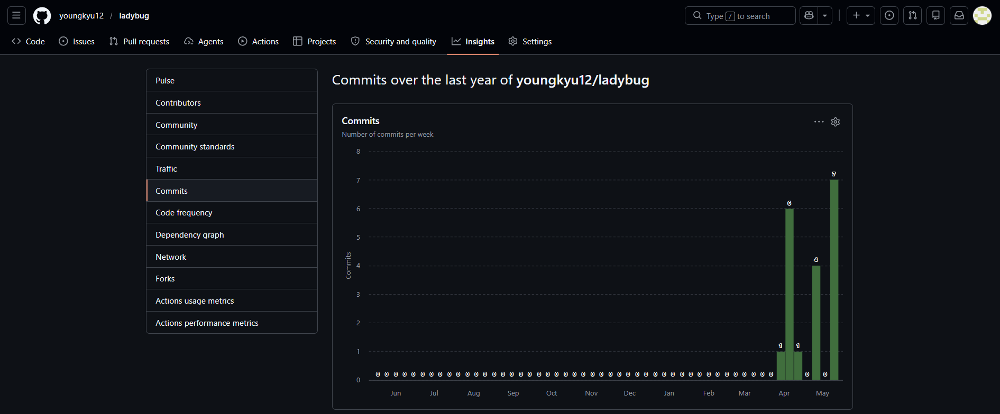
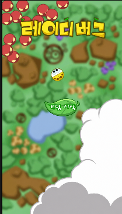
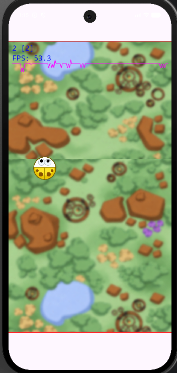

# 🐞 Ladybug - 텀 프로젝트 2차 발표

## 📌 제출 정보

| 항목                    | 링크                                                                                                               |
|-----------------------|------------------------------------------------------------------------------------------------------------------|
| 프로젝트 제목               | **Ladybug**                                                                           |
| Git Repository        | [youngkyu12/ladybug](https://github.com/youngkyu12/ladybug)                                                      |
| 2차 발표 영상              | [2차 발표 영상](TODO_2차_발표_영상_URL)                                                                                    |
| 1차 발표 영상              | [1차 발표 영상](https://youtu.be/jJiFIIa5MSA)                                                                                    |
| 1차 발표 때 버전의 README.md | [1차 발표 README.md](https://github.com/youngkyu12/ladybug/blob/d4902d7634d96e7a3af38170f36b83d7a12ad3c0/README.md) |
| 개발 계획 체크 리스트          | [개발 계획 체크리스트](https://github.com/youngkyu12/ladybug/blob/main/andprj/README.md)                                  |

---

## 🎮 1. 게임 소개

**Ladybug**는 스마트폰을 기울여 무당벌레를 조작하고, 화면 위쪽에서 내려오는 적을 피하면서 오래 생존하는 캐주얼 생존 액션 게임이다.

플레이어는 자이로스코프 입력을 이용해 무당벌레를 움직인다.  
게임 중에는 적과 아이템이 등장하며, 적과 충돌하면 게임이 종료되고 아이템을 획득하면 공격 또는 방어 효과를 얻는다.

### 핵심 플레이 흐름

1. 스마트폰 기울기 입력으로 플레이어 이동
2. 화면 위쪽에서 내려오는 적 회피
3. 랜덤 아이템 획득
4. 아이템 효과로 적 제거 또는 방어
5. 생존 시간과 적 처치에 따라 점수 상승
6. 점수가 높아질수록 난이도 상승

---

## 🚧 2. 현재까지의 진행 상황

| 항목 | 진행률 | 현재 상태 |
|---|---:|---|
| 프로젝트 생성 및 기본 환경 구성 | 100% | Android Studio 프로젝트 생성 완료 |
| ViewBinding / BuildConfig 설정 | 100% | ViewBinding과 Debug 설정 사용 |
| a2dg 모듈 연결 | 100% | `:a2dg` 모듈을 app에 연결 |
| 타이틀 화면 구성 | 90% | 배경 이미지와 시작 버튼 구성 완료 |
| MainActivity → LadyBugActivity 전환 | 100% | 버튼 입력 및 Debug 자동 실행 처리 |
| LadyBugActivity 구성 | 80% | `BaseGameActivity` 상속 및 Debug Grid/FPS 표시 설정 |
| MainScene 생성 | 60% | `MainScene` 생성 및 root scene 연결 완료 |
| 게임 배경 리소스 추가 | 70% | `game_background.png` 리소스 추가 |
| 세로 스크롤 배경 적용 | 20% | 리소스 준비, Scene 적용 진행 중 |
| Player 클래스 | 0% | 구현 예정 |
| Enemy 클래스 | 0% | 구현 예정 |
| Item 클래스 | 0% | 구현 예정 |
| 충돌 판정 | 0% | 구현 예정 |
| 점수 / 타이머 UI | 0% | 구현 예정 |
| PauseScene | 0% | 구현 예정 |
| 전체 게임 루프 | 20% | Activity / Scene 진입 구조 구현 |

현재 2차 발표 기준으로는 **게임 실행 구조와 Scene 연결 골격을 만드는 단계**까지 진행되었다.  
이후 단계에서 Player, Enemy, Item, 충돌 판정, UI를 순서대로 구현할 예정이다.

---

## 🧾 3. Git Commit 현황

현재 GitHub 저장소 기준 commit 수는 총 **19개**이다.

### GitHub Insights Commits

아래 이미지는 GitHub 저장소의 commit 활동을 보여주는 자료이다.

---

---
