# ladybug
TUKorea Dept. of Game Engineering  
Smartphone Game Programming Lecture Term Project

## 프로젝트 개요
본 프로젝트는 2010년경 출시된 스마트폰 게임 **Lady Bug**를 모작으로 하는 캐주얼 생존 액션 게임이다.  
플레이어는 스마트폰의 기울기 입력을 이용하여 무당벌레를 조작하고, 화면 위쪽에서 내려오는 적을 피하면서 최대한 오래 생존해야 한다.

게임 도중 화면에 무작위로 등장하는 아이템을 획득하면 적을 제거하거나 일시적으로 안전지대를 만들 수 있으며, 이를 통해 생존 시간을 늘리고 높은 점수를 획득할 수 있다.  
초반에는 적이 상단에서만 등장하지만, 점수가 높아질수록 좌측과 우측에서도 적이 등장하여 난이도가 점차 상승한다.

### 개발 환경
* IDE: Android Studio
* Language: Kotlin
* Platform: Android
* Input: 자이로스코프 센서 기반 조작

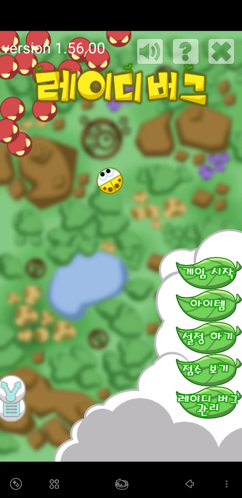

---

## 1. 게임 컨셉

### High Concept
**“스마트폰을 기울여 무당벌레를 움직이고, 쏟아지는 적을 피하며 아이템으로 반격하는 생존형 캐주얼 액션 게임”**

플레이어는 빠르게 움직이는 적들 사이에서 생존해야 하며, 단순 회피만으로는 오래 버티기 어렵다.  
따라서 랜덤하게 등장하는 아이템을 적절히 획득하고 활용하는 것이 핵심 전략이 된다.  
즉, **회피 중심 플레이 + 아이템 활용을 통한 반격**이 결합된 게임이다.

### 장르
* 스마트폰 캐주얼 액션 게임
* 생존형 아케이드 게임
* 싱글 플레이 게임

---

## 2. 핵심 메카닉

### 2-1. 자이로스코프 조작
* 스마트폰을 기울이면 플레이어가 해당 방향으로 이동한다.
* 살짝 기울이면 천천히 이동하고, 크게 기울이면 빠르게 이동한다.
* 플레이어는 기울기 강도를 조절해 세밀한 회피와 빠른 탈출을 모두 수행할 수 있다.

### 2-2. 적 회피
* 게임 시작 후 빨간색 적이 화면 상단에서 내려온다.
* 화면 상하좌우에서 생성된 적은 생성 직후 플레이어 방향으로 직선 운동한다.
* 플레이어가 적에 닿으면 즉시 게임 오버가 된다.
* 시간이 지날수록 적의 수가 많아지고, 점수가 높아질수록 등장 방향(상하좌우)이 늘어난다.

### 2-3. 아이템 생성
* 아이템은 일정 간격으로 상단에서 랜덤하게 생성된다.
* 생성된 아이템은 벽에 튕기며 이동하고, 먹기 전까지 화면 안을 돌아다닌다.

### 2-4. 아이템 활용
* 아이템을 획득하면 적을 제거하거나, 일정 시간 방어 효과를 얻거나, 공격 기능을 발동할 수 있다.
* 아이템 활용은 생존 시간을 크게 늘려주므로 고득점을 위해 매우 중요하다.
* 아이템을 이용해 적을 제거하면 추가 점수를 획득한다.

### 2-5. 점수와 난이도 상승
* 플레이 시간과 적 처치에 따라 점수가 증가한다.
* 점수 10만점 이후에는 좌측에서도 적이 등장한다.
* 점수 30만점 이후에는 우측에서도 적이 등장한다.
* 게임이 진행될수록 단순 회피보다 공간 확보와 아이템 운용이 중요해진다.

---

## 3. 개발 범위

본 프로젝트는 8주간 구현 가능한 수준으로 범위를 설정하며, 주요 요소를 아래와 같이 정량적으로 제시한다.

### 구현 대상 요소
* 플레이어 캐릭터: 1종

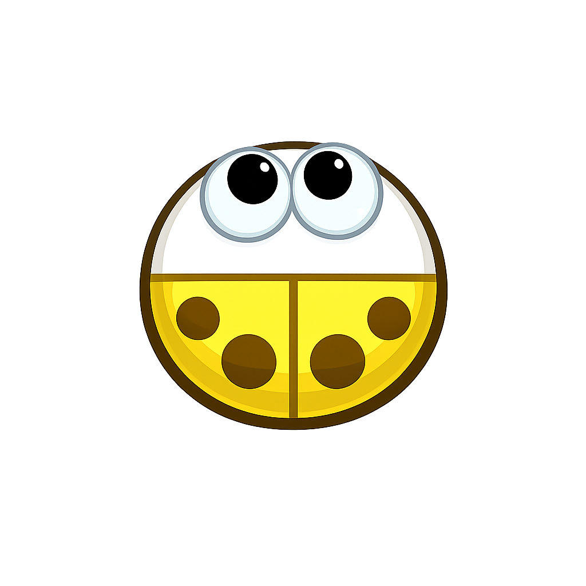

* 적 캐릭터: 1종

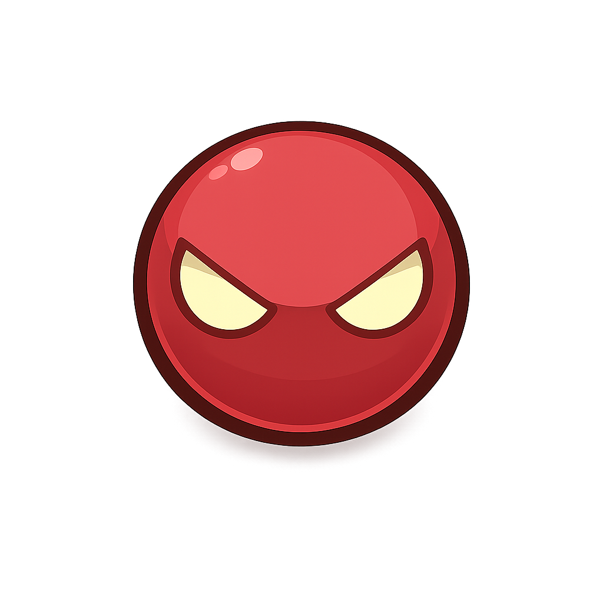

* 아이템 종류: 8종 구현
꽃잎 폭탄
1레벨에 해금됩니다.

제 자리에서 일정 시간동안 회전하는 꽃잎 폭탄입니다.
없어질 때 깜빡이는 애니메이션을 보이며 사라집니다.
레벨	지속 시간
1 30
2	35
3	40
4	45
5	50
6	55
7	60
8	65
9	70
10	75
---
나뭇잎 유도탄
2레벨에 해금됩니다.

3개의 나뭇잎이 적을 따라 다닙니다.
각 나뭇잎마다 하나의 적을 타겟으로 정하고, 타겟과 부딪히면 그 자리에서 폭발합니다.
없어질 때 깜빡이는 애니메이션을 보이며 사라집니다.
레벨	생성 개수	지속 시간
1	3		10
2	4		10
3	4		12
4	4		14
5	5		14
6	5		16
7	5		18
8	6		18
9	6		20
10	6		22
---
꽃잎 보호막
3레벨에 해금됩니다.

플레이어를 감싸는 꽃잎 보호막이 생깁니다.
꽃잎 보호막이 있는 동안은 적으로부터 안전합니다.
일정 시간동안 지속되는 아이템입니다.
없어질 때 깜빡이는 애니메이션을 보이며 사라집니다.
레벨	지속 시간
1	30
2	35
3	40
4	45
5	50
6	55
7	60
8	65
9	70
10	75
---
벌 미사일
4레벨에 해금됩니다.

큰 벌이 앞으로 천천히 이동하면서 부딪히는 적들을 없앱니다.
앞으로만 이동하고 속도가 느린 것이 특징입니다.
없어질 때 깜빡이는 애니메이션을 보이며 사라집니다.
레벨	속도
1	10
2	8
3	7
4	6
5	5
---
베이비 버그
5레벨에 해금됩니다.

아이템을 터뜨린 시점에 플레이어는 여러 마리의 베이비 버그를 획득하게 됩니다.
아주 빠른 시간 동안 플레이어가 보고 있는 방향으로 베이비 버그가 한 마리씩 출동합니다.
베이비 버그 생성 개수는 플레이어 오른쪽에 표시됩니다.
레벨	생성 개수
1	15
2	17
3	19
4	21
5	23
6	25
7	27
8	28
9	29
10	30
---
콩벌레
6레벨에 해금됩니다.

아이템을 터뜨린 순간에 플레이어의 속도로 움직이는 콩벌레가 나옵니다.
콩벌레는 벽에 5번까지 튕기면서 부딪히는 적들을 없앱니다.
없어질 때 깜빡이는 애니메이션을 보이며 사라집니다.
레벨	지속 시간
1	70
2	75
3	80
4	85
5	90
6	95
7	100
8	105
9	110
10	115
---
베이비 버그2
15레벨에 해금됩니다.

플레이어를 중심으로 여러 마리의 베이비 버그가 차례대로 나옵니다.
시계 방향으로 원을 그리면서 한 마리씩 나오고 각 베이비 버그는 자신의 앞쪽으로 전진합니다.
베이비 버그 생성 개수는 플레이어 오른쪽에 표시됩니다.
레벨	생성 개수
1	15
2	17
3	19
4	21
5	23
6	25
7	27
8	28
9	29
10	30
---
코스모스
25레벨에 해금됩니다.

플레이어를 중심으로 8방향 주위에 코스모스가 생성됩니다.
지속 시간이 종료될 때 코스모스가 생성된 방향으로 전진합니다.
레벨별 코스모스 생성 위치는 다음과 같다.
```text
		    1
    1		    1
6     레이디	   5
	     버그
    4		    2
	    	3
```
레벨	생성 개수	지속 시간
1	3		30
2	4		35
3	5		40
4	6		45
5	7		50
6	8		55

* 배경 화면: 1종
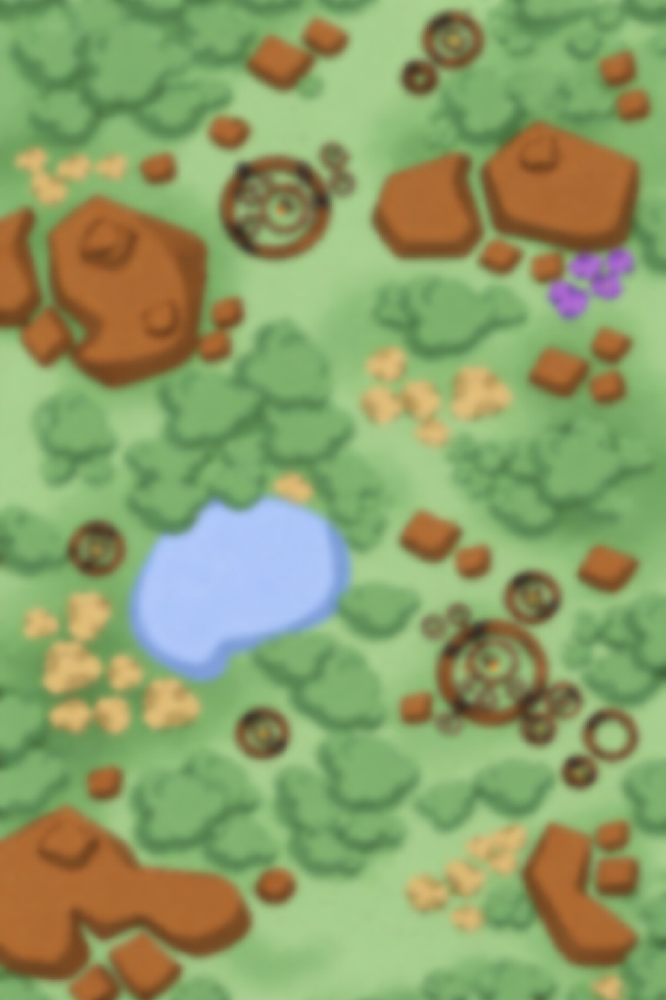

* UI 화면: 5종
  * 메인메뉴 화면
  
  * 인게임 화면
  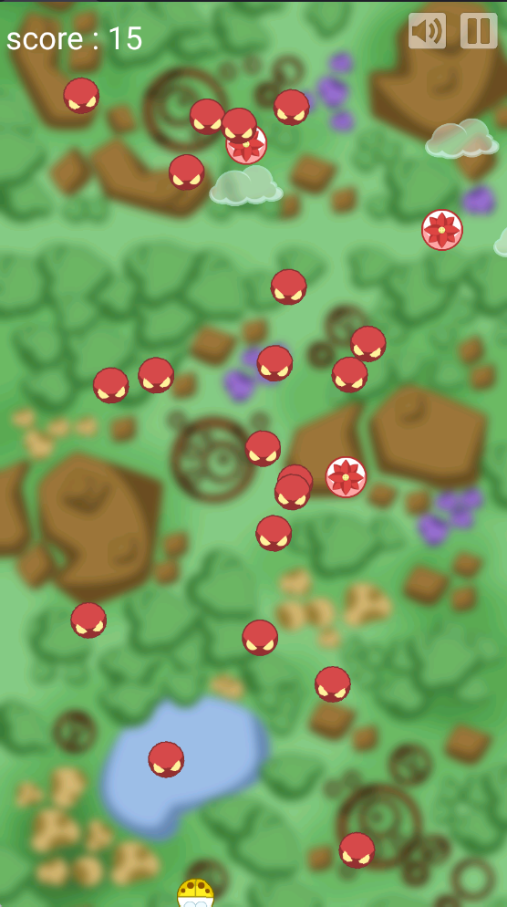
  * 일시정지 화면
  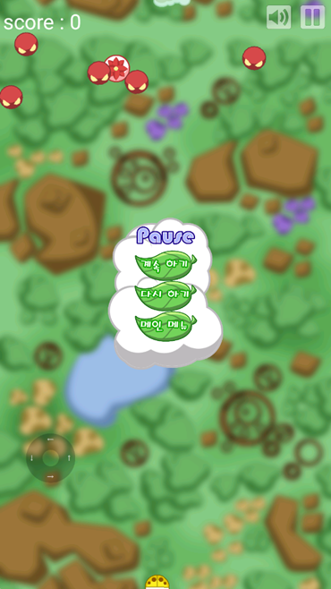
  * 결과 화면
  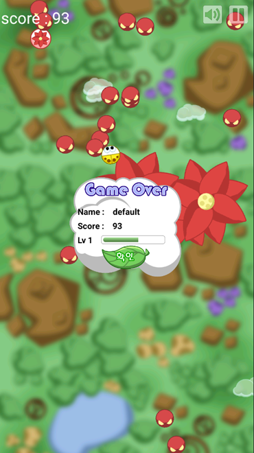
  * 다시시작 화면
  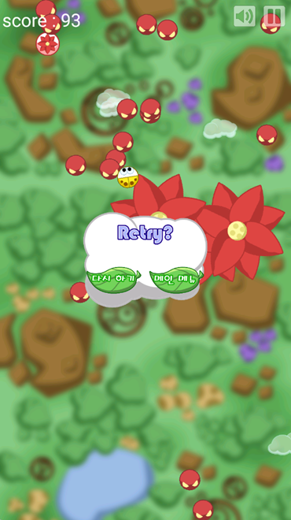
  * 아이템 화면
  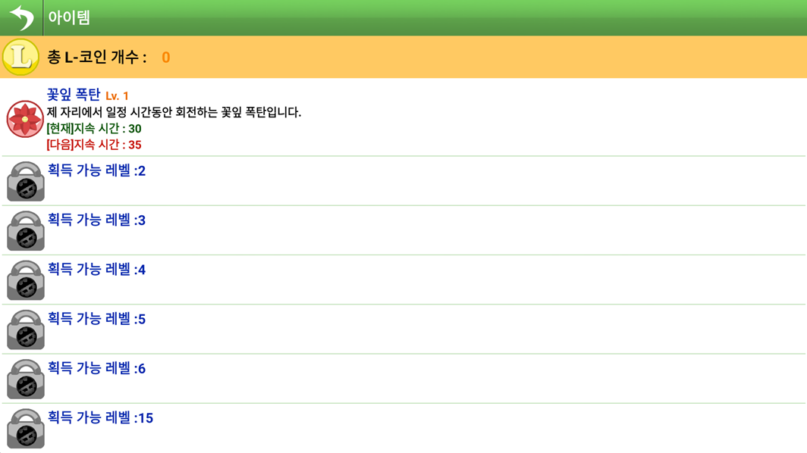
  * 도움말 화면
  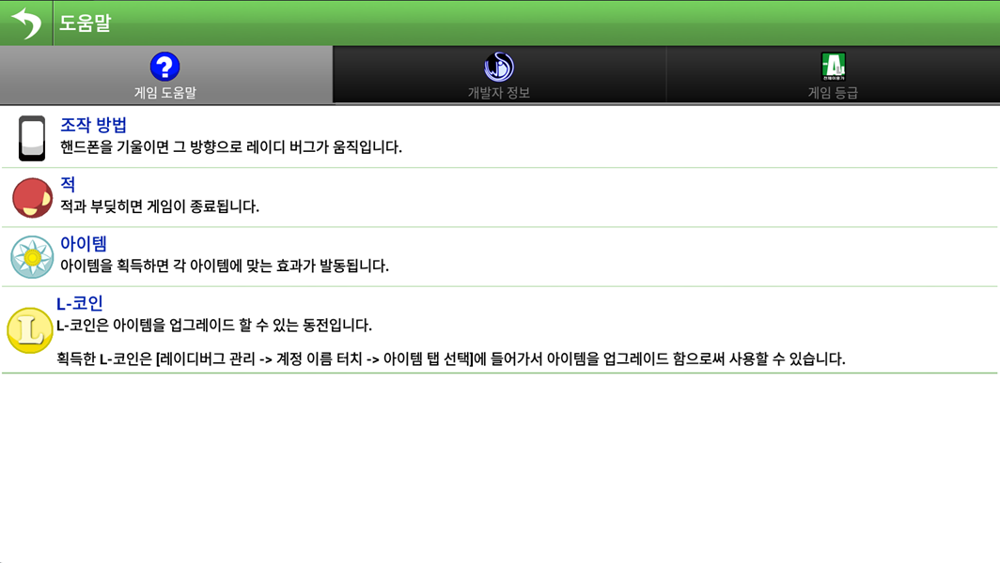
  * 설정 화면
  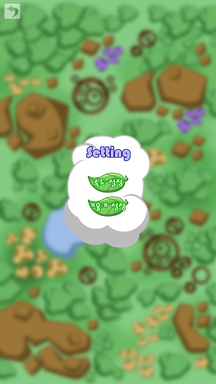
    * 스피드 설정 화면
    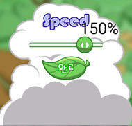
    * 기울기 설정 화면
    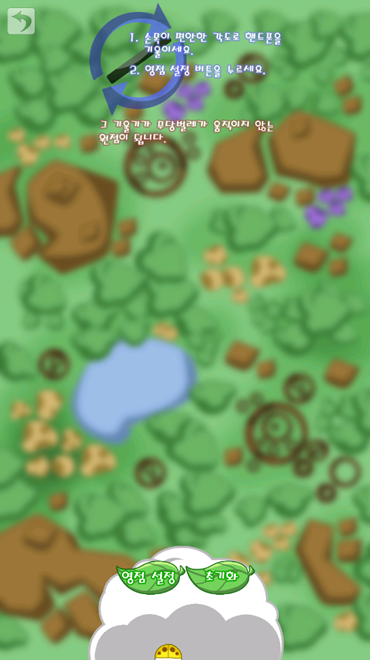
  * 점수 저장 화면
  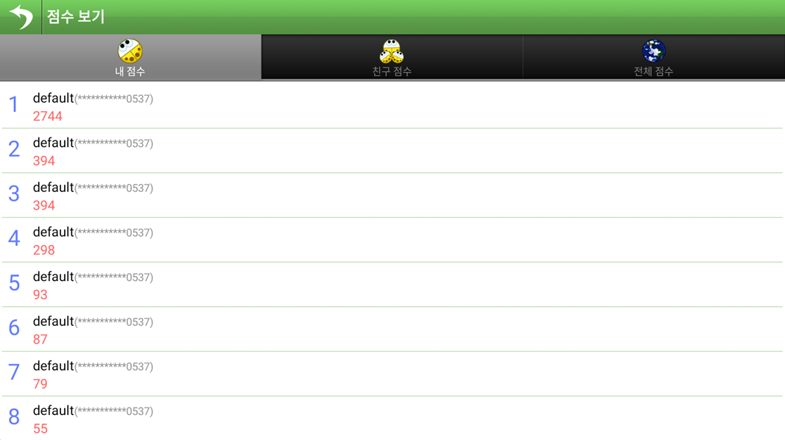
  
* 사운드:
  * 배경음 1개: 게임 시작
  * 효과음 5개
    * 클릭
    * 아이템 획득
    * 적 처치
    * 게임 시작 카운트
    * 게임 종료
* 저장 기능:
  * 최고 점수 저장

### 정량적 구현 목표
* 적 최대 동시 활성 수: 20마리
* 아이템 동시 활성 수: 4개(4개 활성화 시 벽에 한 번 튕긴 아이템은 이후 화면밖으로 나갑니다.)
* 아이템 생성 주기: 4초
* 입력 방식: 자이로스코프 센서 1종
* 게임 1판 평균 플레이 타임 목표: 1분 ~ 3분
* 점수 획득
  * 적 처치 +10점
  * 시간 0.01초당 +1점
  * 아이템 활성화 시 +100점
* 플레이어 레벨과 아이템 레벨
  * 플레이어는 1레벨부터 점수에 따라 경험치가 상승합니다.
  * 아이템은 레벨 제한이 있고, L-코인으로 레벨업할 수 있습니다.
  * L-코인은 5레벨 초과부터 1레벨당 한 개씩 얻을 수 있습니다.
* 점수 구간별 난이도 상승 단계: 3단계
  * 기본 단계
  * 10만점 이후 좌측 추가 등장
  * 30만점 이후 우측 추가 등장
* 플레이어 레벨
  * 1레벨부터 만점을 쌓아야 레벨업합니다.
  * 1레벨씩 +만점을 쌓아야 레벨업합니다.

### 제외 범위
* 온라인 랭킹 기능
* 친구 점수 랭킹 기능
* 아이템 9번, 10번
---

## 4. 예상 게임 실행 흐름

### 4-1. 전체 실행 흐름
1. 게임 실행
2. 타이틀 화면 표시
3. 시작 버튼 입력
4. 인게임 진입
5. 상단에서 적 생성
6. 플레이어가 자이로 조작으로 적 회피
7. 아이템 랜덤 생성
8. 아이템 획득 후 적 제거 또는 방어
9. 점수 증가 및 난이도 상승
10. 적과 충돌 시 게임 오버
11. 결과 화면에서 점수 확인 후 재시작 또는 타이틀 화면

## 5. 개발 일정

### 1주차 (4/6 ~ 4/12)
* 전체 화면 구성
* 메인메뉴 화면 및 시작 화면 구현
* Android Studio 프로젝트 생성

### 2주차 (4/13 ~ 4/19)
* 자이로스코프 센서 연동
* 플레이어 이동 및 속도 조절 구현
* 화면 밖 이동 제한 처리

### 3주차 (4/20 ~ 4/26)
* 적 오브젝트 생성 기능 구현
* 상단 적 등장 및 이동 구현
* 플레이어와 적의 충돌 판정 구현
* 게임 오버 로직 구현
* 인게임 점수 UI 배치

### 4주차 (4/27 ~ 5/3)
* 시간 점수 및 적 처치 점수 시스템 구현
* 최고 점수 저장 기능 구현
* 결과 화면 및 다시시작 화면 구현
* 일시정지 기능 구현
* 인게임 UI 정리

### 5주차 (5/4 ~ 5/10)
* 아이템 랜덤 생성 기능 구현
* 아이템 벽 반사 이동 구현
* 꽃잎 폭탄, 나뭇잎 유도탄, 꽃잎 보호막 구현
* 아이템 획득 및 발동 처리 구현

### 6주차 (5/11 ~ 5/17)
* 벌 미사일, 베이비 버그, 콩벌레 구현
* 베이비 버그2, 코스모스 구현
* 아이템 지속 시간 및 생성 수치 적용
* 아이템별 애니메이션 및 효과 테스트

### 7주차 (5/18 ~ 5/24)
* 난이도 상승 로직 구현
* 좌측, 우측 적 추가 등장 구현
* 설정 화면, 기울기 설정 화면 구현
* 도움말 화면, 아이템 화면 구현
* 배경음 및 효과음 추가

### 8주차 (5/25 ~ 5/31)
* 전체 게임 밸런스 조정
* 버그 수정 및 최적화
* UI 최종 정리
* README 최종 수정
* 발표 영상 녹화
* 최종 제출 파일 정리 및 제출